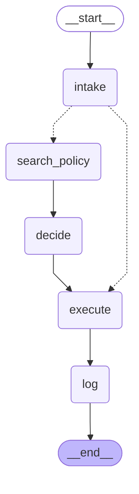

```mermaid
---
config:
  flowchart:
    curve: linear
---
graph TD;
	__start__([<p>__start__</p>]):::first
	intake(intake)
	search_policy(search_policy)
	decide(decide)
	execute(execute)
	log(log)
	__end__([<p>__end__</p>]):::last
	__start__ --> intake;
	decide --> execute;
	execute --> log;
	intake -.-> execute;
	intake -.-> search_policy;
	search_policy --> decide;
	log --> __end__;
	classDef default fill:#f2f0ff,line-height:1.2
	classDef first fill-opacity:0
	classDef last fill:#bfb6fc

```
